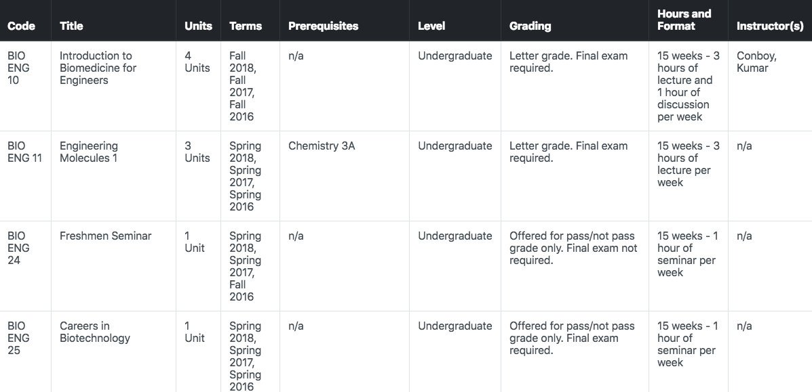

# berkeley-academic-guide-webscraper
A webscraper for the [Berkeley Academic Guide](guide.berkeley.edu) that summarizes departmental course info for easy viewing

## Files
* main.py – scrapes information off of Berkeley Academic Guide
* style.css – styles the final table
* test.html – where the summary table is generated; this is eventually opened in the browser

## Download
```
$ git clone https://github.com/priyasundaresan/berkeley-academic-guide-webscraper
```

## Dependencies
* pprint – to "pretty print" scraped info
* beautifulsoup4 – a webscraping library
* unicodedata – keep unicode characters intact
* yattag – generate HTML code pythonically
```
$ pip install pprint
$ pip install beautifulsoup4
$ pip install unicodedata
$ pip install yattag
```

## Usage
* In main.py, change line 16 with the link to any Berkeley Academic Guide department, ex:
```
url = "http://guide.berkeley.edu/courses/bio_eng/"
```
* Navigate to the directory containing main.py, style.css, test.html and run the following in Terminal:
```
$ python3 main.py
```
* A browser window will automatically open with the generated HTML table, refresh page if needed

